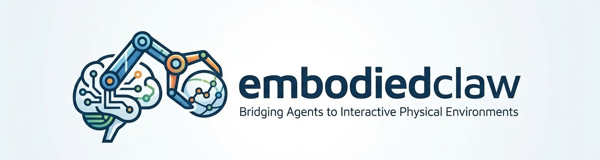

<p align="center">
  
</p>

<h1 align="center">EmbodiedClaw: Bridging Agents to Interactive Physical Environments</h1>

<p align="center">
  <a href="https://github.com/InternRobotics/EmbodiedClaw"></a>
  
  
  
</p>

---

## 📰 News

* **[2026.03.24]** 🔥🔥 **Phase 1 Released** — Simulation engine (InternUtopia), nanobot interface, and MCP server are now open-source!

---

## Introduction

**EmbodiedClaw** is an open-source framework for training and evaluating embodied AI agents on household manipulation tasks. Agents interact with a physics-based simulation through [Model Context Protocol (MCP)](https://modelcontextprotocol.io/) tool calls, receiving multimodal observations (RGB images + structured text) in return.

### 🌟 Key Highlights

* **MCP-native interface**: Exposes action primitives as standard MCP tools over SSE/HTTP — any MCP-compatible agent (Claude, GPT-4o, local models) can plug in without modification.
* **Multimodal observations**: Every tool call returns an RGB image plus structured text feedback, enabling vision-language agents to reason about the scene.
* **Physics-based simulation**: Built on [InternUtopia](https://github.com/InternRobotics/InternUtopia) (Isaac Sim), providing realistic object interactions and articulated manipulation.
* **End-to-end pipeline**: From simulation through evaluation to training — a unified framework covering the full embodied AI development cycle.

---

## Demo


https://github.com/user-attachments/assets/dbee2203-f745-4068-a9e5-770f3372390e


---

## Roadmap

| Stage | Status | Description |
|-------|--------|-------------|
| Phase 1 | ✅ **Released** | Simulation engine (InternUtopia), nanobot interface, MCP server |
| - | 🔜 Coming soon | Task & trajectory generation pipeline (GRScenes + Mesatask) |
| - | 🔜 Coming soon | Agent implementation, SFT & RL training pipeline |
| - | 🔜 Coming soon | Technical report |


---

## Available MCP Tools

| Tool | Description |
|------|-------------|
| `list_receptacles` | List all receptacles by room |
| `navigate_to` | Navigate to a furniture receptacle |
| `explore_receptacle` | Survey all objects on the current receptacle |
| `focus_on` | Focus camera on a specific object by marker ID |
| `find_objects` | Find and highlight objects of a given category in view |
| `highlight_receptacles` | Highlight all visible receptacle surfaces |
| `pick` | Pick up an object by marker ID |
| `place` | Place held object onto a receptacle surface |
| `open` / `close` | Operate articulated doors |


Each tool call returns an RGB observation image and structured text feedback from the simulation.

---

## Quick Start

### 1. Clone with submodules

```bash
git clone --recurse-submodules git@github.com:EmbodiedClaw/EmbodiedClaw.git
```

### 2. Install the InternUtopia

Please refer to the InternUtopia [doc](https://internrobotics.github.io/user_guide/internutopia/get_started/installation.html). 

### 3. Install other dependencies

```bash
pip install -r requirements.txt
```

### 4. Download and unpack assets

Download `assets.tar.gz` from the [google drive](https://drive.google.com/drive/folders/15RXHNisGn5SZTLvFWYkdKKazNvxaRrVd?usp=sharing), extract to the repo path.


The `assets/` directory should scenes, models, objects, materials, and metadata required by the demo.

### 5. Run the demo MCP server

```bash

./scripts/demo/run_mcp_server_debug.sh

```

The server listens on port `8080` (override with `PORT=<n>`). Connect any MCP-compatible agent to `http://localhost:8080/sse`.


### 6. Connect with nanobot (MCP Client)

[nanobot](https://github.com/EmbodiedClaw/nanobot) is a lightweight MCP client that lets you chat with the simulation via any LLMs.

**Step 1 — Install nanobot**

Follow the installation instructions in the [nanobot repository](https://github.com/EmbodiedClaw/nanobot).

**Step 2 — Configure nanobot**

In the nanobot config file, add the Isaac Sim MCP server under `tools → mcpServers`:

```json
{
  "tools": {
    "mcpServers": {
      "embodiedclaw": {
        "url": "http://127.0.0.1:8080/sse",
        "type": "sse",
        "toolTimeout": 300,
        "no_proxy": true
      }
    }
  }
}
```

**Step 3 — Run nanobot gateway**

```bash
nanobot gateway
```

You can now chat with the agent and issue manipulation commands through the simulation.

---


## 📑 Citation

The technical report is coming soon. Please stay tuned! 

---

## Acknowledgement

EmbodiedClaw is built on top of [**InternUtopia**](https://github.com/InternRobotics/InternUtopia) and [**nanobot**](https://github.com/EmbodiedClaw/nanobot).

We thank the teams behind [**Model Context Protocol**](https://modelcontextprotocol.io/) and [**NVIDIA Isaac Sim**](https://developer.nvidia.com/isaac-sim) for their foundational work.

---

## License

This project is licensed under the [MIT License](LICENSE).
